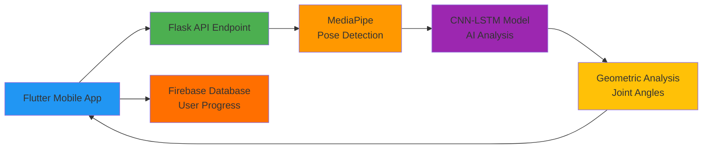
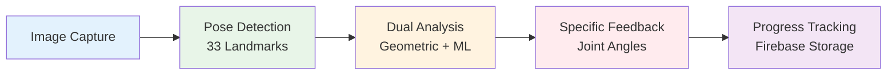
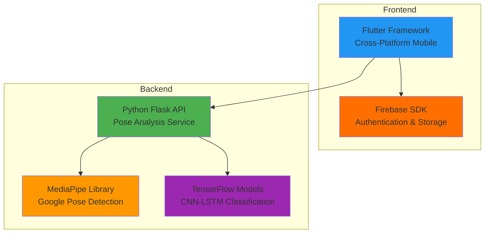
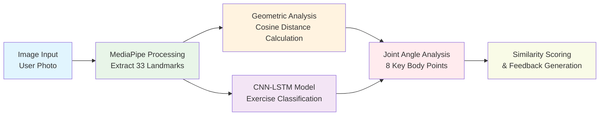
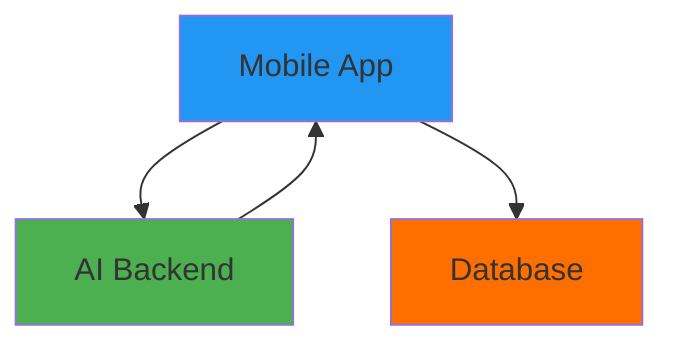
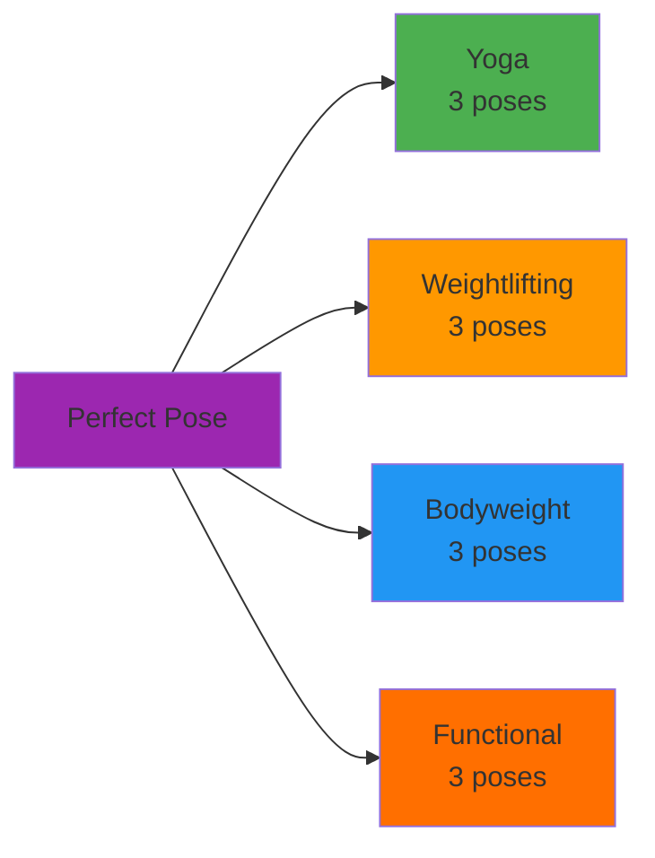

# Perfect Pose - Simplified Presentation Diagrams

Clean, simple diagrams perfect for presentation slides with other content.

---

## **System Architecture Overview** 
*Clean system overview for slides*



---

## **User Workflow**
*Clean user journey for slides*



---

## **Technology Stack**
*Key technologies and integrations*



---

## **AI Processing Pipeline**
*Detailed analysis workflow*



---

## **System Components**
*Ultra-simple component view*



---

## **Exercise Categories**
*Simple category breakdown*



---

## **Usage Guide for Slides**

### **Best for Presentation Slides:**
1. **System Architecture Overview** - Shows complete system in 6 components
2. **User Workflow** - User journey in 5 technical steps  
3. **AI Processing Pipeline** - Detailed dual analysis workflow
4. **Technology Stack** - Professional technology overview

### **When to Use:**
- **System Architecture**: During technical solution overview (1:00 mark)
- **User Workflow**: During user experience explanation (2:00 mark)  
- **AI Processing Pipeline**: During detailed technical deep-dive
- **Technology Stack**: For Q&A or technical credibility

### **Why These Work Better:**
- ✅ **Fewer elements** - easier to read on slides
- ✅ **Larger text** - readable from distance
- ✅ **Simple colors** - works with other slide content
- ✅ **Clear flow** - audience can follow easily

### **Slide Layout Tips:**
```
Your presentation text     [Simple diagram]
• Key technical points     [App screenshot]  
• Impressive metrics       
```

### **Color Scheme:**
- 🔵 **Blue**: Frontend/Mobile
- 🟢 **Green**: Backend/API
- 🟠 **Orange**: AI/ML
- 🟡 **Firebase Orange**: Database
- 🟣 **Purple**: Core system 
