# Perfect Pose - Simplified Presentation Diagrams

Clean, simple diagrams perfect for presentation slides with other content.

---

## **Simple Architecture Overview** 
*Clean system overview for slides*

```mermaid
graph LR
    A[Flutter App<br/>📱] --> B[Python API<br/>🤖]
    B --> C[MediaPipe<br/>👁️]
    C --> D[AI Analysis<br/>⚡]
    D --> A
    A --> E[Firebase<br/>🔥]
    
    style A fill:#2196F3
    style B fill:#4CAF50
    style C fill:#FF9800
    style D fill:#9C27B0
    style E fill:#FF6F00
```



---

## **Simple Data Flow**
*Clean user journey for slides*

```mermaid
flowchart LR
    A[📸 Take Photo] --> B[🤖 AI Analysis]
    B --> C[📊 Get Feedback]
    C --> D[📈 Track Progress]
    
    style A fill:#e3f2fd
    style B fill:#e8f5e8
    style C fill:#fff3e0
    style D fill:#f3e5f5
```



---

## **Tech Stack - Minimal**
*Simple technology overview*


---

## **AI Processing Pipeline**
*Simple AI workflow*


---

## **System Components**
*Ultra-simple component view*


---

## **Exercise Categories**
*Simple category breakdown*


---

## **Usage Guide for Slides**

### **Best for Presentation Slides:**
1. **Simple Architecture Overview** - Shows complete system in 5 boxes
2. **Simple Data Flow** - User journey in 4 steps
3. **AI Processing Pipeline** - Technical flow in 4 steps

### **When to Use:**
- **Architecture Overview**: During technical solution (1:00 mark)
- **Data Flow**: During user experience explanation (2:00 mark)  
- **AI Pipeline**: During detailed technical explanation

### **Why These Work Better:**
- ✅ **Fewer elements** - easier to read on slides
- ✅ **Larger text** - readable from distance
- ✅ **Simple colors** - works with other slide content
- ✅ **Clear flow** - audience can follow easily

### **Slide Layout Tips:**
```
[Your text content]    [Simple diagram]
[Key bullet points]    [App screenshot]
```

### **Color Scheme:**
- 🔵 **Blue**: Frontend/Mobile
- 🟢 **Green**: Backend/API
- 🟠 **Orange**: AI/ML
- 🟡 **Firebase Orange**: Database
- 🟣 **Purple**: Core system 
