# PATENT DIAGRAMS FOR LEGAL SUBMISSION

## Figure 1: Dual-Phase Biometric System Architecture
*Referenced in [0009] and [0017-0020]*

## Figure 2: Enhanced Physiological Scanner Workflow
*Referenced in [0010] and [0021-0024]*

## Figure 3: Advanced Body Estimator Pipeline
*Referenced in [0011] and [0025-0029]*

## Figure 4: PPG Signal Processing Algorithm
*Referenced in [0012] and [0024]*

```mermaid
flowchart TD
    401[Facial Video<br/>Sequence Input] --> 402[ROI Extraction<br/>Cheek Regions]
    402 --> 403[Adaptive Region<br/>Sizing]
    403 --> 404[Skin Tone<br/>Filtering]
    
    404 --> 405[Green Channel<br/>Isolation]
    405 --> 406[Butterworth Filter<br/>0.7-4.0 Hz Bandpass]
    406 --> 407[Baseline Trend<br/>Removal]
    407 --> 408[Kalman Filtering<br/>Noise Reduction]
    
    408 --> 409[FFT Analysis<br/>Frequency Domain]
    409 --> 410[Peak Detection<br/>Physiological Range<br/>42-240 BPM]
    410 --> 411[Heart Rate Calculation<br/>Peak Frequency × 60]
    
    subgraph "420 - QUALITY ASSESSMENT"
        411 --> 421[Signal-to-Noise<br/>Ratio Analysis]
        421 --> 422[Peak Prominence<br/>Assessment]
        422 --> 423[Consistency<br/>Evaluation]
        423 --> 424[Confidence Score<br/>Generation]
    end
    
    424 --> 430[Heart Rate Output<br/>BPM + Confidence]
```

## Figure 5: RLHF Continuous Learning System
*Referenced in [0013] and [0030-0034]*

## Figure 6: System Architecture & Performance Stack
*Referenced in [0014] and [0038-0041]*

## Figure 7: Processing Pipeline Performance Map
*Referenced in [0015]*

## Figure 8: Privacy-Preserving Data Protection Architecture
*Referenced in [0016] and [0035-0037]*

---

